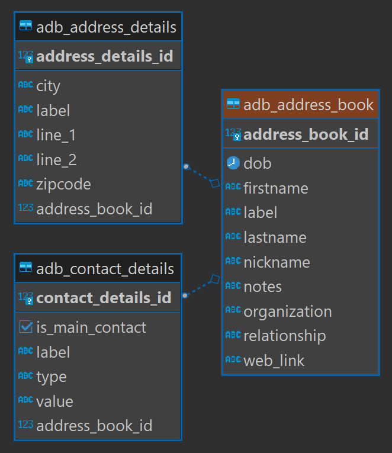

### Address Book

The idea is build an Address Book API (Something like **Contacts** in Mobile phones) 

**Entity** - AddressBookEntity.java

 

**References** :

[Java Persistence Wiki](https://en.wikibooks.org/wiki/Java_Persistence)

[Spring Data JPA – Rest CRUD API example](https://www.bezkoder.com/spring-boot-jpa-crud-rest-api/) - For referring `hibernate.ddl-auto`